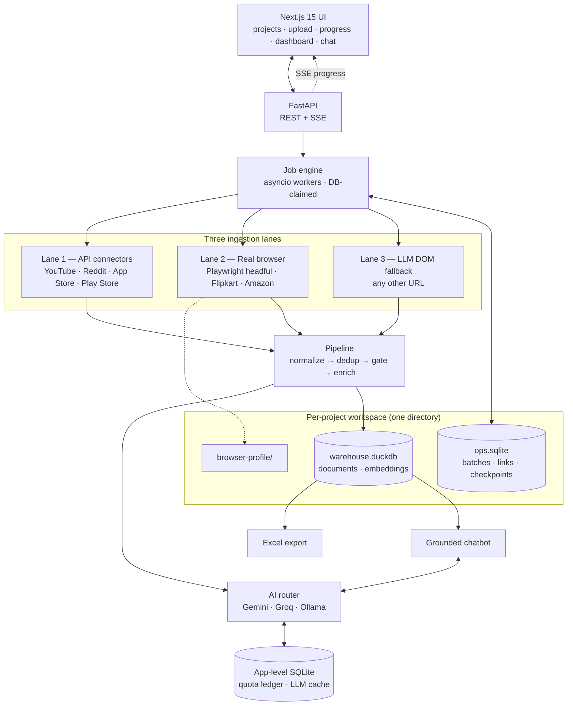
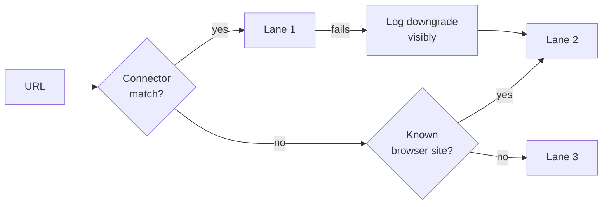

# ARCHITECTURE.md — AI Discovery Engine

> Status: design, pre-build. This defines the HOW. `PROBLEM_STATEMENT.md`
> defines the WHAT/WHY and `CONTEXT.md` expands it into personas and risks —
> both remain authoritative for scope. This document answers the four open
> questions that problem statement deliberately deferred (§9), and adds the
> feasibility research those answers depend on.
>
> Feasibility findings dated **2026-08-29**. Several overturn what most
> online tutorials still say — see §2.3.

---

## 1. Design constraints

Non-negotiable inputs to every decision below:

| Constraint | Source | Consequence |
|---|---|---|
| **Costs $0** | Operator requirement | Free tiers and open source only. No paid proxies, no captcha services, no API budget. |
| **AI = Gemini + Groq** | Operator requirement | Free tiers of both, with a local fallback so quota exhaustion degrades rather than fails. |
| **No auth bypass, no captcha solving, no login automation** | `PROBLEM_STATEMENT.md` §6 | Shapes the entire commerce-site strategy — see §5. |
| **Nothing fabricated** | §6 | Missing field stays `null`. Enforced in the schema, not by convention. |
| **Fail loudly** | §6 | A typed failure taxonomy, surfaced per-link. See §8.1. |
| **Single-operator research tool** | §5 | No multi-tenancy, no distributed queue, no auth system. Rules a lot of tempting infrastructure *out*. |
| **Quality, not a prototype** | Operator requirement | Real front end over a notebook-grade dashboard; typed contracts; resumable jobs. |

---

## 2. Feasibility: what is actually extractable

This section exists because the answer is not uniform, and three of the
requested sources changed materially in 2026.

### 2.1 Verdict table

| Source | Verdict | Method | Real ceiling |
|---|---|---|---|
| YouTube comments | 🟢 **Green** | Official Data API v3 | 10,000 units/day; `commentThreads.list` costs 1 unit per 100 comments → ~1M comments/day |
| Reddit posts + comments | 🟢 **Green** | Official OAuth API (`asyncpraw`) | 100 queries/min, free for non-commercial; ~1,000-item listing cap per endpoint |
| App Store reviews | 🟢 **Green** | `itunes.apple.com` RSS `customerreviews` JSON, no key needed | **Hard cap 500 per country** (10 pages × 50) — widen by iterating country codes |
| Play Store reviews | 🟢 **Green** | `google-play-scraper` — Google's own `batchexecute` RPC with continuation tokens | Hundreds to low thousands per language — widen by language + country |
| Flipkart reviews | 🟢 **Green** *(browser lane)* | Real Chrome + network interception | Human-paced; robust if we read their JSON, brittle if we read their HTML |
| Flipkart Q&A | 🟡 **Amber** | Same lane, deferred to v1.1 | Schema is ready today (§8) |
| Amazon reviews (logged out) | 🟡 **Amber** | Browser lane | **~8–13 featured reviews only** — see §2.3 |
| Amazon reviews (signed in) | 🟡 **Amber** | Browser lane, `operator_session` opt-in | Full set, but requires a policy decision — see §5.3 |
| Amazon Q&A | 🔴 **Red** | — | Behind the same wall as reviews |
| Myntra | 🟠 **Orange** | Browser lane, best-effort | PerimeterX behavioural ML. Will be flaky. We do not fight it — see §5.4 |

### 2.2 What "green" buys you

A realistic mixed batch — say 3 apps across both stores, 10 YouTube videos, and
15 Reddit threads — resolves to roughly **20,000–60,000 documents**, entirely
through sanctioned APIs, at zero cost, unattended, in well under an hour. That
is the product. The commerce lane is a valuable extension, not the foundation,
and the build order in §15 reflects that.

### 2.3 Three findings that invalidate most existing guidance

**Reddit's `.json` endpoint is dead.** Appending `.json` to any thread URL
returned data for a decade and is still the top answer everywhere online. Since
**May 2026 it returns HTTP 403 unauthenticated.** OAuth is now mandatory.

This settles `PROBLEM_STATEMENT.md` §9 question 2, and the framing matters:
registering your own free API application and using its client credentials is
**sanctioned first-party API access**, not "login automation." No user's login
is automated, no access control is circumvented, nothing is bypassed. It sits
comfortably inside §6. The free tier is 100 queries/minute for non-commercial
use — more than this tool will ever need.

**Amazon hardened in May 2026.** `/product-reviews/<ASIN>/` now returns Amazon's
own "Page Not Found" to logged-out clients, and full review bodies were stripped
out of the public product page HTML. What remains publicly visible is the
featured sample the product page renders — typically 8 to 13 reviews.

This is worth being precise about, because it is easy to misdiagnose: **this is
not an anti-bot problem, and no amount of browser realism solves it.** The data
is genuinely absent from the logged-out DOM. A human in a private window sees
the same 8–13 reviews. The only way past it is being signed in, which is a
policy question (§5.3), not a technical one.

**Free PaaS is effectively gone.** Fly.io and Railway moved to trial/usage-based
models; Render's free tier cold-starts. Combined with the browser lane's need
for a real desktop Chrome, this makes local-first the correct deployment (§14).

**Sources:** [Amazon 2026 scraping status](https://scrape.do/blog/scrape-amazon-reviews/) · [Reddit API 2026](https://www.socialcrawl.dev/blog/reddit-data-api-2026) · [Gemini free tier](https://www.aifreeapi.com/en/posts/gemini-api-rate-limits-per-tier) · [Groq free tier](https://tokenmix.ai/blog/groq-free-tier-limits-2026) · [YouTube quota](https://www.getphyllo.com/post/youtube-api-limits-how-to-calculate-api-usage-cost-and-fix-exceeded-api-quota) · [App Store 500-review cap](https://www.rivioo.app/blog/app-store-review-limits) · [free hosting 2026](https://snapdeploy.dev/blog/free-cloud-deployment-platforms-2026-comparison)

---

## 3. System topology



---

## 4. The three-lane ingestion model

The central architectural idea. Different sources demand fundamentally
different access strategies, and pretending otherwise is what makes generic
scrapers brittle.

### Lane 1 — API connectors

Server-side, async, unattended, safely parallel. Covers all four green sources
and carries essentially all the volume. Uses each platform's sanctioned API or
public feed. Predictable, rate-limited by documented quotas, and stable across
site redesigns because there is no HTML involved.

### Lane 2 — Real browser

**Playwright driving a headful, real Chrome with a persistent profile.**

This is the answer to "if it's visible in the browser, why can't we read it?"
The answer is: we can. The reason headless scrapers fail on Flipkart and
Myntra is fingerprinting — WebGL, TLS, CDP artifacts, datacenter IPs, absent
plugin surfaces. Stealth plugins patch some of those and lose to modern
detection anyway.

A real Chrome binary with a real profile on a residential connection has
**nothing to spoof, because nothing is fake.** That is a categorically
different posture from evasion, and it is why this lane works without a single
paid proxy.

Two techniques make it durable rather than brittle:

**Read the network, not the DOM.** Hook `page.on("response")` and capture the
JSON the site's own frontend already fetches. Flipkart's CSS class names are
hashed and rotate roughly fortnightly — anything selector-based breaks on that
cadence. Their internal JSON API is far more stable. This single choice is the
difference between a lane that needs monthly repair and one that mostly does
not.

**Human pacing is a correctness requirement, not politeness theater.**
Behavioural detection survives a perfect fingerprint: drive a real browser
through 500 pages at machine speed and PerimeterX still flags the *behaviour*.
So: jittered 3–8s navigation, randomised scroll depth, one tab, no parallelism.

The honest cost is throughput. One real browser at human pace handles tens to
low hundreds of pages, not tens of thousands. Lane 2 complements Lane 1; it
never replaces it.

### Lane 3 — LLM-assisted DOM extraction

Generic fallback for any URL with no dedicated connector: fetch, strip to clean
text, hand to Gemini with a JSON schema, receive normalized rows. Makes "paste
any link" true without writing an adapter per site. Lower confidence, and
stamped as such via the `lane` provenance field (§8).

### Lane selection



A Lane 1 → Lane 2 downgrade is **always logged as a visible event.** A silent
downgrade hides rot: the run still succeeds, quality quietly drops, and nobody
notices for weeks.

---

## 5. Connecting to a real browser

### 5.1 Four options

| Option | Mechanism | Verdict |
|---|---|---|
| **Playwright persistent profile** | `launch_persistent_context(user_data_dir=..., channel="chrome", headless=False)`. App launches real Chrome against a profile directory that persists cookies. Operator signs in once, manually; it sticks. | **Primary.** No extension to build. |
| **CDP attach** | Operator starts Chrome with `--remote-debugging-port=9222`; app calls `connect_over_cdp()` and drives the browser they are already using. | **Use for `operator_session`.** Maximum realism — their real daily-driver profile. |
| Companion MV3 extension + localhost WebSocket | Content script reads the rendered DOM, posts to `ws://127.0.0.1:8787/capture`. Fully human-in-the-loop; zero automation signature. | Optional v1.1. Genuinely viable, most maintenance. |
| Playwright MCP + its Chrome extension | Microsoft's MCP server; its official extension attaches to an existing session with the default profile. | Only when driving the engine from an MCP client. |

### 5.2 An extension is not required

Playwright's persistent context provides the same real-browser, real-profile,
signed-in-state capability with substantially less to build and maintain. The
WebSocket bridge is documented so the door stays open, not because it is needed.

The profile directory lives **inside the project** (§7.1), so different research
projects never share cookies or session state.

### 5.3 The policy boundary — an explicit flag, never a hidden default

`PROBLEM_STATEMENT.md` §6 forbids auth bypass, captcha solving, and login
automation, and says to capture only what is publicly visible.

The browser lane breaks **none of the first three.** No access control is
circumvented. Any captcha is solved by a human in their own browser. The
operator signs in manually — the application never sees, stores, or transmits a
credential.

But a signed-in session does exceed *"publicly visible."* That deserves a
conscious decision rather than a quiet default:

```yaml
session_mode: logged_out        # DEFAULT — strictly within §6 as written
session_mode: operator_session  # opt-in — captures what the signed-in
                                # operator already sees with their own eyes
```

This is set **per project** (§7.2), not globally — the right answer depends on
what that particular study is for.

Choosing `operator_session` means amending §6 to read *"capture only what the
operator is authorised to see, without bypassing any access control."* That is a
defensible position, but it must be adopted deliberately and recorded in the
problem statement — not inherited by accident from a config default.

Site terms of service still apply. This is a single-operator research tool
(§5), not a redistribution pipeline.

### 5.4 The firm line

**No paid residential proxies. No IP rotation. No fingerprint spoofing. No
captcha-solving services.**

That is where "read what a real browser renders" becomes evasion — and it also
breaks the $0 constraint, since every one of those is a paid product.

**Myntra is where this bites.** It runs PerimeterX with per-site behavioural
models. We attempt it on the browser lane at human pace; if it resists, we
record `BLOCKED_ANTIBOT` and stop. That is a documented limit of the design, not
a defect awaiting a fix. A site actively resisting collection is a signal to
stop, not a puzzle to solve.

---

## 6. Stack

### Backend — Python 3.12 + FastAPI

Every extractor needed already exists in Python: `google-play-scraper` for the
batchexecute RPC path, `asyncpraw` for Reddit OAuth, `playwright` for the
browser lane, plus the entire embedding and AI-provider ecosystem. Choosing Node
would mean reimplementing the Play Store RPC work by hand for no gain.

FastAPI is async-native — hundreds of concurrent extractions cost almost
nothing — and streams SSE cleanly for the per-link progress §4 requires.

**No Celery, no Redis, no Postgres.** A distributed task queue is infrastructure
tax with no payoff for a single-operator tool. An asyncio worker pool with job
state in SQLite delivers the same resumability with zero services to run.

### Frontend — Next.js 15 + TypeScript + Tailwind + shadcn/ui

With TanStack Query for server state and Recharts for the dashboard. Live
progress over **SSE** — one-way, proxy-safe, and simpler than WebSockets for
what is fundamentally a progress stream.

This is a deliberate step up from a notebook-grade dashboard. Per-link live
progress across a long batch is exactly the interaction those tools handle
worst, and §4's "never feels like a black box" is a real requirement.

### Supporting libraries

`httpx` (async) + `tenacity` (backoff) + a per-domain token bucket with jitter;
`selectolax` for parsing; **`fastembed`** (BAAI/bge-small-en-v1.5, ONNX, CPU) for
embeddings — free, unlimited, no quota, no API call; `polars` + `xlsxwriter` for
export.

---

## 7. Projects — the unit of work

A **project** is a named, self-contained workspace. Every batch, document,
export, chat thread, and browser session lives inside exactly one project and
never leaks across.

The reason this matters: **research is longitudinal.** A PM tracking a
competitor doesn't paste twenty links once — they paste more each week for a
quarter. Batch-scoped storage would leave them reconciling exports by hand,
which is precisely the failure mode §1 of the problem statement is written
against. A batch is one collection run. A project is the study.

### 7.1 A project is a directory

```
projects/
├─ competitor-atlas/
│  ├─ project.yaml           config: session_mode · sources · locales · rate overrides
│  ├─ ops.sqlite             batches · links · checkpoints · chat history
│  ├─ warehouse.duckdb       documents · embeddings
│  ├─ browser-profile/       persistent Chrome profile — this project's sessions only
│  ├─ gate/prototypes.yaml   this project's research question, as prototype sentences
│  ├─ exports/
│  └─ logs/
└─ food-delivery-study/
   └─ …
```

Because SQLite and DuckDB are each a single file and the browser profile is a
plain directory, a project is **portable by construction.** Zip it and move it
to another machine. Back it up with a file copy. Delete it with `rm -rf` and
nothing outside is affected. No migration tooling, no orphaned rows left behind
in a shared database, no "which of these 40,000 documents belonged to that
study" archaeology.

### 7.2 What project scoping buys

**Cross-batch analysis by default.** The dashboard and chatbot query the entire
project unless you narrow to a specific batch. "What do people complain about
most" then answers across everything collected on this subject over three
months, not just today's paste. This is the single biggest reason projects
exist rather than a `tag` column.

**Isolated browser sessions.** Each project owns its Chrome profile directory.
One project running `operator_session` signed into Amazon cannot contaminate
another running `logged_out`. A block or rate-limit incurred in one project
stays in that project rather than poisoning all your research at once.

**Per-project policy.** `session_mode`, enabled sources, locale fan-out, and
rate overrides live in `project.yaml`. The §5.3 policy decision is made per
study, which is correct — it depends on what that particular research is for.

**A tuned gate.** The three-stage gate (§11.2) filters against hand-written
prototype sentences. Those are research-question-specific: a project studying
fintech onboarding needs different prototypes than one studying delivery times.
Storing them with the project keeps the gate sharp instead of generic.

**Correctly scoped deduplication.** `doc_id` dedup runs within a project. The
same Play Store review legitimately appearing in two projects becomes two rows
in two warehouses — they are separate studies and should not share state.

### 7.3 The two things that are deliberately global

**The quota ledger is app-level, not per-project.** Gemini's daily limit
attaches to your API key, not to your research. Two projects each believing they
hold 1,500 requests/day would blow the real ceiling and start failing mid-run
with a confusing error.

So the ledger lives outside `projects/` in a single app-level SQLite database,
and every project's AI calls draw from one shared pool. Projects compete for
quota; the router allocates fairly and the UI reports remaining daily budget so
a long run doesn't die halfway through unexplained.

**The LLM response cache is also global**, keyed on content hash rather than
project. Two projects classifying the same YouTube video pay once. In
competitive research, overlapping subjects are the norm rather than an edge
case, so this is a real saving.

---

## 8. Data model

```
doc_id  project_id  batch_id  source  doc_type  source_url  subject
product_id  variant  captured_at  authored_at  author_hash  text  lang
rating  verified_purchase  engagement  parent_id  lane  extractor_version  raw
```

**`doc_type`** ∈ `review | comment | post | qa_question | qa_answer`. Combined
with `parent_id` self-linking, a Q&A pair is two linked rows. Q&A extraction is
deferred to v1.1, but the schema accommodates it today with **zero migration**.

**`doc_id = sha256(source | source_url | author_hash | normalize(text))`.**
Author is deliberately included: a thousand genuine reviews that all say "good
app" are a thousand data points, and hashing text alone would silently collapse
them into one — quietly corrupting every downstream count.

**Nullable stays nullable.** A missing date is `authored_at: null`, never
inferred from `captured_at`. A Reddit comment has no `rating` and that is not a
gap to fill. This enforces §6's "nothing fabricated" structurally rather than by
reviewer discipline.

**`lane` + `extractor_version`** travel with every row as provenance. When a
field looks wrong six weeks later, you can tell whether it came from a
sanctioned API or an LLM reading a DOM — and that difference is the whole story.

### 8.1 Failure taxonomy

`CONTEXT.md` flagged that "fail loudly" needs categories before a UI can render
anything useful. Here they are:

| Code | Retryable | Meaning |
|---|---|---|
| `INVALID_URL` | no | Malformed or unparseable |
| `UNSUPPORTED_SOURCE` | no | No connector, and Lane 3 declined |
| `NOT_FOUND` | no | 404 / removed / deleted |
| `AUTH_REQUIRED` | no | Content behind a login — we stop here by design |
| `BLOCKED_ANTIBOT` | no | Actively resisted. We do not escalate |
| `RATE_LIMITED` | **yes** | Backoff and requeue |
| `QUOTA_EXHAUSTED` | **yes** | Daily free-tier ceiling; resumes tomorrow |
| `NETWORK_ERROR` | **yes** | Transient |
| `PARSE_ERROR` | no | Structure changed — needs a human |
| `EMPTY_RESULT` | no | Resolved fine, genuinely no content |
| `EXTRACTOR_CRASH` | no | Bug. Surfaced, never swallowed |

Plus `LANE_DOWNGRADE` as a first-class visible event (§4).

---

## 9. Storage

Two embedded engines, each doing what it is good at. Both zero-ops, both $0.

**SQLite (WAL mode)** — operational state: batches, links, per-link status,
checkpoints, chat history. Handles the constant stream of small status writes
well. One per project, plus one app-level database for the shared quota ledger
and response cache (§7.3).

**DuckDB** — analytical store: normalized documents, embeddings, dashboard
aggregations, Parquet and Excel export. Columnar, so a group-by across 100k
documents returns instantly. One per project.

**Critical constraint: DuckDB is single-writer.** Workers never write to it
directly. They stage through SQLite and a single committer flushes in batches.
Getting this wrong is the most likely way to corrupt the warehouse, so it is a
design rule rather than an implementation detail.

Because each project owns its own pair of files, two projects can extract
concurrently without contending for a single writer lock.

---

## 10. Extraction engine

### 10.1 The connector protocol

One file per source, registered in one line. This is what makes "add a fifth
source" a small job instead of a redesign — the property §5 of the problem
statement promises.

```python
class Connector(Protocol):
    id: str
    lane: Lane
    concurrency: int
    rate: RateSpec

    def match(self, url: str) -> JobSpec | None: ...
    async def expand(self, job: JobSpec, ctx: Ctx) -> list[JobSpec]: ...
    async def run(self, job: JobSpec, ctx: Ctx) -> AsyncIterator[Doc]: ...
```

**Connectors never call `httpx` directly.** All I/O goes through `ctx` —
`ctx.fetch()` (rate-limited, jittered, retrying), `ctx.emit()`,
`ctx.checkpoint()`, `ctx.log()`, `ctx.signal`. Politeness and rate limiting
become *structural* rather than something each connector author must remember.
`ctx` also carries the project's config, so locale fan-out and `session_mode`
reach the connector without global state.

`expand()` handles one-link-to-many: an App Store URL expands into one job per
country code; a Play Store URL into one per language.

### 10.2 Concurrency — settles §9 question 1

**Bounded parallelism per source**, not sequential. Sequential is safe but
needlessly slow; unbounded is reckless. Each source gets its own semaphore and
token bucket:

| Source | Concurrent | Pace |
|---|---|---|
| YouTube | 4 | Generous quota, low risk |
| App Store | 3 | ~1 req/s |
| Reddit | 2 | Well inside 100 QPM |
| Play Store | 1–2 | Heavy jitter — unofficial endpoint |
| Browser lane | 1 | Jittered 3–8s. Never parallel |

These limits are **global across projects**, not per project — the rate limit
belongs to the remote service, and two projects hitting Reddit at once still
share one 100 QPM budget.

Per-link progress remains individually visible regardless, which is what §4
actually asks for — visibility, not serialism.

### 10.3 Checkpointing and resume

Every job persists its cursor — continuation token, page number, country code —
after each successful page. A crash at link 40 resumes at link 40's last page,
not at link 1.

Combined with `doc_id` deduplication and the LLM response cache (§11),
re-running an identical batch re-extracts nothing and re-charges nothing,
satisfying §8's fourth success criterion.

---

## 11. AI layer

### 11.1 The free tiers are inverted — and it dictates the design

| | RPM | TPM | RPD |
|---|---|---|---|
| **Gemini Flash** | ~10 | **250,000** | 500–1,500 |
| **Groq Llama 3.1 8B** | **30** | 6,000 | 14,400 |

Groq offers many *requests* but few *tokens per minute*. Gemini is the reverse.

This matters more than it first appears. Groq's 6,000 TPM is the binding
constraint: at roughly 3,000 tokens per batched request, you get **two requests
per minute**. Routing bulk labeling to Groq — the obvious choice, given it is
the "fast" provider — would make a 5,000-document batch take over two hours.

**So the routing is the opposite of the intuitive one:**

**Gemini Flash handles bulk classification.** Batches of ~25 documents per
request with JSON-schema-constrained output. About 200 requests per 5,000
documents, comfortably inside the daily ceiling. **Throughput ≈ 37,500
documents/day, free.**

**Groq handles interactive work and failover.** 30 RPM is well suited to chatbot
turns and single-document re-runs where latency is what the user feels. It takes
over bulk duty when Gemini's daily quota is exhausted. Groq's prompt caching
extends the tier further, since cached tokens do not count against rate limits.

**Ollama is the optional local fallback**, so exhausting both quotas degrades
the run rather than failing it.

### 11.2 Most documents never reach an API

A three-stage gate, cheapest first:

1. **Lexical prefilter** — obvious keeps and drops. Free.
2. **Embedding similarity** — `fastembed` locally against the project's
   prototype sentences (§7.2). Free, unlimited, no network.
3. **LLM** — only the ambiguous middle band.

Deduplication (simhash), language detection, and a lexicon sentiment prior all
run locally too. This is what closes the gap `CONTEXT.md` flagged as an
"unfunded mandate": the dashboard's sentiment chart has an owner, and most of
its work costs nothing.

### 11.3 Router mechanics

The app-level quota ledger (§7.3) tracks RPM, TPM, and RPD per provider on
rolling windows and selects the target per call. Every response is cached keyed
on content hash + prompt version — which is what actually makes §8's
"re-running doesn't re-charge" true rather than aspirational.

---

## 12. Grounded chatbot — settles §9 question 3

Scoped to the current **project** by default, narrowable to a single batch.

Hybrid retrieval: **BM25 via SQLite FTS5** for lexical precision, plus **vector
search** over `fastembed` embeddings for semantic recall. Results merge, rerank,
and go to Gemini Flash under a strict contract:

- **Answer only from retrieved evidence.** Cite `doc_id`s.
- **Ask before answering** when the question doesn't specify a source, field, or
  comparison — return `needs_clarification`, and never answer and ask at once.
- **Say so when evidence is thin.** An explicit "I don't have enough data for
  that" is a correct answer; a confident-sounding guess is a failure.
- **The denominator is documents, never people.** One person can write ten
  reviews. "12% of documents mention battery life" is true; "12% of users" is
  fabricated.
- **Flag cross-source comparisons as not directly comparable.** Play Store
  reviews and Reddit comments have different populations, incentives, and
  selection biases. Counting them side by side without a caveat is misleading
  even when the arithmetic is right.
- **Flag cross-time comparisons within a project.** Because a project
  accumulates batches over months, "complaints are up" may reflect more
  collection rather than more complaints. The denominator has to be stated.

The last two rules are what make a long-running, mixed-source project honest
rather than merely aggregated.

Chat history persists in the project's `ops.sqlite`, so a study's line of
questioning survives restarts.

---

## 13. API surface

Everything is nested under a project.

| Method | Path | Purpose |
|---|---|---|
| `POST` | `/projects` | Create — scaffolds the directory |
| `GET` | `/projects` | List with rollup stats |
| `GET` | `/projects/{p}` | Detail: batches, document counts, quota used |
| `PATCH` | `/projects/{p}` | Update `project.yaml` config |
| `DELETE` | `/projects/{p}` | Delete project and its directory |
| `POST` | `/projects/{p}/batches` | Submit links. Returns `batch_id` immediately |
| `GET` | `/projects/{p}/batches/{id}` | Batch status summary |
| `GET` | `/projects/{p}/batches/{id}/stream` | **SSE** per-link progress |
| `GET` | `/projects/{p}/batches/{id}/links` | Per-link detail, including failure codes |
| `POST` | `/projects/{p}/batches/{id}/retry` | Retry the retryable failures |
| `GET` | `/projects/{p}/documents` | Paged, filterable — **across all batches** |
| `GET` | `/projects/{p}/export.xlsx` | Export whole project, or `?batch_id=` for one |
| `POST` | `/projects/{p}/chat` | Grounded Q&A over the project |
| `GET` | `/quota` | App-level remaining daily budget |

**Flow:** `POST /projects/{p}/batches` classifies each URL by source, writes
rows as `pending`, and returns without blocking. Workers claim and dispatch.
Connectors stream documents through normalize → dedup → the project's warehouse.
SSE reports throughout. Enrichment runs after extraction completes.

### 13.1 MCP server

The engine also exposes itself over MCP — `list_projects`, `create_project`,
`extract_links`, `query_project`, `export_project` — so Claude Code or any MCP
client can drive it directly. Same job engine underneath; MCP is a second front
door, not a second implementation.

---

## 14. Deployment and the upgrade path

**Local-first, Docker Compose.** Free PaaS is largely gone (§2.3), and the
browser lane needs a real desktop Chrome, so local is simultaneously the
cheapest and the most capable option. It also matches §5's "single-operator
research tool" exactly.

### 14.1 Three rules that keep the door open

Local-only today must not become a rewrite later. These cost nothing now:

1. **Job claiming goes through the database, never an in-memory queue.** Workers
   claim with `UPDATE ... WHERE status='pending' ... RETURNING`, not an
   `asyncio.Queue`. Behaviour is identical with one process today — but running
   N workers across N machines later needs *zero* redesign, and the same pattern
   ports unchanged to Postgres. **This is the highest-leverage decision here.**
2. **Everything config-driven** via `pydantic-settings`: paths, base URLs, keys,
   concurrency limits. No absolute paths, no hardcoded `localhost`. The
   projects root is one such setting.
3. **Frontend talks to backend over HTTP + SSE only.** No shared filesystem, no
   Python imports. Relocating the backend becomes one environment variable.

### 14.2 What each future move costs

| Move | Cost |
|---|---|
| Local → cloud backend | Env vars + deploy. Compose file already exists |
| Add remote workers | No code change, given rule 1 |
| SQLite → Postgres | Small, if SQL stays portable (avoid `INSERT OR REPLACE`) |
| DuckDB → MotherDuck | A connection string |
| Local UI → Vercel | `API_BASE_URL` + CORS |
| Move one project to another machine | Copy the directory. Nothing else |

**The browser lane never moves to a free cloud host** — free tiers do not
provide a real desktop Chrome with a persistent profile. If the API is hosted
remotely later, Chrome stays on a machine the operator controls and pulls jobs
from the same table. That hybrid topology is reachable as a configuration
change, not a migration project.

### 14.3 Cost model

| Component | Free allowance | Headroom |
|---|---|---|
| Gemini Flash | 1,500 req/day, 250k TPM | ~37,500 docs/day classified |
| Groq | 14,400 req/day | Interactive + failover |
| YouTube Data API | 10,000 units/day | ~1M comments/day |
| Reddit API | 100 queries/min | Far beyond need |
| App Store RSS | Unmetered | 500/country |
| Play Store | Unmetered (unofficial) | Self-limited for politeness |
| `fastembed` | Local CPU | Unlimited |
| SQLite + DuckDB | Embedded | Disk only |
| Hosting | Local | $0 |

**Total: $0**, with the AI ceiling — not extraction — as the binding constraint,
and that ceiling shared across all projects (§7.3).

---

## 15. Repository layout and build order

```
ai-discovery-engine/
├─ backend/app/
│  ├─ main.py            FastAPI + SSE
│  ├─ api/               projects · batches · links · export · chat
│  ├─ projects/          scaffold · config · lifecycle · resolver
│  ├─ connectors/        Lane 1 — base · youtube · reddit · appstore · playstore
│  ├─ browser/           Lane 2 — session · intercept · sites/
│  ├─ fallback/          Lane 3 — llm_dom
│  ├─ pipeline/          normalize · dedup · gate · enrich
│  ├─ ai/                router · providers · quota · cache
│  ├─ store/             sqlite (ops) · duckdb (analytics)
│  ├─ chat/              retrieval · grounding
│  └─ export/            excel
├─ frontend/             Next.js 15
├─ extension/            optional companion (v1.1)
├─ data/
│  ├─ app.sqlite         global quota ledger + LLM cache
│  └─ projects/          one directory per project (§7.1)
├─ docker-compose.yml
└─ Docs/
```

**Phased build.** The ordering principle: the risky work must never block a
working product.

| Phase | Delivers |
|---|---|
| **0** | Skeleton, **project scaffolding**, schema, storage, job engine, SSE |
| **1** | **The four green connectors + Excel export** |
| **2** | Normalize, dedup, local enrichment |
| **3** | AI layer — router, quota, cache, batch classification |
| **4** | Dashboard and charts |
| **5** | Grounded chatbot |
| **6** | Browser lane — Flipkart, Amazon |
| **7** | Lane 3 fallback + Q&A extractors |

Projects land in Phase 0 deliberately. Retrofitting a container concept after
data exists means writing a migration; building it first costs almost nothing
since it is mostly a path resolver.

**Phase 1 alone satisfies the first success criterion** in §8 of the problem
statement — 20 mixed links in, one Excel file out, no manual cleanup. Everything
fragile lands afterward, against a product that already works.

---

## 16. Decisions

### Resolved here

| Question | Answer |
|---|---|
| §9.1 Sequential vs. parallel | **Bounded parallelism per source** (§10.2) |
| §9.2 Reddit tier | **OAuth mandatory** — `.json` is dead. Sanctioned API access, not a §6 violation |
| §9.3 Chatbot grounding | Hybrid FTS5 + vector retrieval, citation-enforced, clarify-before-answer (§12) |
| §9.4 App topology | **One standalone app.** FastAPI orchestrator owns all three lanes. No extension dependency |
| Sentiment ownership | Three-stage gate (§11.2) — the gap `CONTEXT.md` flagged |
| Checkpoint identity | `doc_id` (§8) |
| Failure taxonomy | §8.1 |
| Work organisation | **Projects as self-contained directories** (§7) |

### Still open — need an operator decision

1. **`session_mode`** (§5.3). Default `logged_out` ships strictly within §6.
   Enabling `operator_session` unlocks full Amazon reviews but requires
   consciously amending §6. **Recommend: ship `logged_out`, decide later with
   real data in hand.**
2. **Amazon's value at 8–13 reviews per product** (§2.3). Possibly still useful
   for breadth across many products; possibly not worth the browser lane's cost.
   Worth testing in Phase 6 before committing.
3. **Country/language fan-out policy.** Both app stores cap per locale, so
   coverage is a deliberate multiplier on runtime. Needs a per-project default.
4. **Cross-project search.** Projects are isolated by design, but "have I
   already collected this?" across studies may eventually be worth a read-only
   index. Deliberately out of scope for v1.

### Deliberately declined

**Myntra beyond best-effort** (§5.4), and every technique that would make it
work: paid proxies, IP rotation, fingerprint spoofing, captcha solving. Each
breaks the $0 constraint, and collectively they cross the line from reading a
real browser into evasion.
